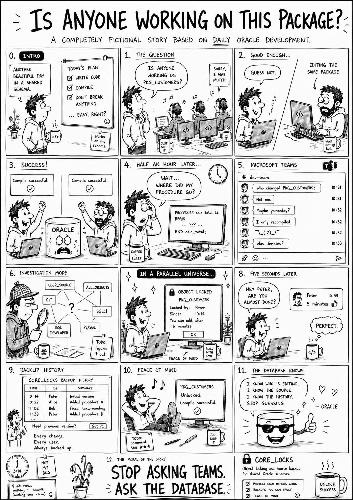

# CORE_LOCKS

## Object locking and source backup for shared Oracle schemas – standalone, no framework required

<br>
<p></p>
<br>

## Table of Contents

1. [Project Overview](#1-project-overview)
2. [Prerequisites & Requirements](#2-prerequisites--requirements)
3. [Installation & Setup](#3-installation--setup)
4. [Proxy Users & Startup Script](#4-proxy-users--startup-script)
5. [How It Works](#5-how-it-works)
6. [API Reference](#6-api-reference)
7. [Configuration](#7-configuration)
8. [Operational Notes](#8-operational-notes)

---

## 1. Project Overview

**CORE_LOCKS** answers a single question on a shared development schema: *who last touched this object, and am I about to overwrite their work?*

It hooks every DDL statement in the schema, records who ran it, keeps a copy of the source, and refuses a compile when someone else already holds a live lock on that object. Two developers compiling the same package no longer silently overwrite each other; the second one gets an error instead of a surprise.

This repo is extracted from the author's [CORE23](https://github.com/jkvetina/CORE23) framework. In CORE23, the LOCK feature depends on the `CORE` and `CORE_CUSTOM` packages plus the `CORE_LOGS` table, roughly 6,300 lines of framework for what is really a self-contained idea. This version cuts that away.

**Key characteristics:**

- **Five objects** – one table, one package, one trigger, two jobs
- **No framework** – no `CORE`, no `CORE_CUSTOM`, no logging tables
- **Source backup included** – every lock row carries a copy of the object's DDL
- **Drop-in** – install into any schema that has APEX available

---

## 2. Prerequisites & Requirements

Oracle Database 12c or later (identity columns are used for `lock_id`).

Two grants are required from `SYS`:

```sql
GRANT EXECUTE ON dbms_crypto TO <schema>;      -- SHA-256 source hashing
GRANT EXECUTE ON dbms_scheduler TO <schema>;   -- the locksmith enable job
```

`APEX_STRING` must be reachable; `get_object` uses `APEX_STRING.SPLIT_CLOBS` to normalize the captured DDL. `DBMS_OUTPUT` is used by `unlock` for feedback.

Every developer should reach the schema under an identifiable name, because a lock is only useful when you know who to call about it. Sessions that offer no name fall back to their IP address, and the `core_locksmith` trigger refuses the DDL when there is not even that. Setting this up has its own section: [Proxy Users & Startup Script](#4-proxy-users--startup-script).

---

## 3. Installation & Setup

Install in this order – the package body will not compile before the table exists, and the trigger needs the package:

```
database/tables/core_locks.sql
database/packages/core_lock.spec.sql
database/packages/core_lock.sql
database/triggers/core_locksmith.sql
database/jobs/core_locksmith_enable.sql
database/jobs/core_locks_purge.sql
```

Both jobs are optional but recommended; see [Operational Notes](#8-operational-notes) for what they do and why they matter.

---

## 4. Proxy Users & Startup Script

A lock is only as good as the name on it. Generic shared logins are rejected by design; a lock owned by "the schema account" tells you nothing about who to call. A session that offers no name gets its IP address instead, and one that cannot offer even that is refused with `USER_ERROR: USE_PROXY_USER_OR_SET_CLIENT_ID` (see [The IP fallback](#the-ip-fallback)).

There are two ways to give a session a real name. Pick one for the whole team.

### Proxy users (recommended)

Each developer gets a personal database login and connects through it to the shared schema. Nobody needs to know the schema password, and taking access away from one person is a single statement.

As a DBA, once per developer:

```sql
CREATE USER jan IDENTIFIED BY "SomeStrongPassword#1";
GRANT CREATE SESSION TO jan;

ALTER USER apps GRANT CONNECT THROUGH jan;
```

The developer then connects with the `proxy[schema]` syntax and their own password:

```sql
CONNECT jan[apps]/"SomeStrongPassword#1"@dev_db
```

In SQL Developer and most other tools the same string goes straight into the username field: `jan[apps]`. The session runs as `apps` with all its privileges, but `SYS_CONTEXT('USERENV', 'PROXY_USER')` returns `JAN`, and that is the name the lock rows carry. Nothing to run after connecting, nothing to forget; the identity is part of the connection itself.

To take the access away again:

```sql
ALTER USER apps REVOKE CONNECT THROUGH jan;
```

### Startup script (CLIENT_IDENTIFIER)

No DBA willing to create users? Then each session identifies itself:

```sql
BEGIN
    DBMS_SESSION.SET_IDENTIFIER('JAN');
END;
/
```

**Use the same name you have in the APEX Builder.** This is the part people get wrong, and it costs them later. Your locks follow you between tools only when the name does, so if the Builder knows you as `JAN`, put `JAN` in the startup script too. Get that right and you can edit a package in the Object Browser, finish it in your own editor, and it stays one lock held by one person the whole time. Get it wrong and `JAN` in the browser and `JKVETINA` in SQL Developer are two colleagues who keep locking each other out, and both of them are you.

The catch: `CLIENT_IDENTIFIER` lives only as long as the session. Reconnect and it is gone, and your next lock row falls back to your operating system login, or a bare IP address, instead of the name you meant. So don't run it by hand; wire it into your tool so it fires on every connect:

- **SQL Developer** – Tools > Preferences > Database > "Filename for connection startup script", pointed at a file containing the block above.
- **SQLcl and SQL\*Plus** – put the block into `login.sql`, which runs after every `CONNECT`. Since 12.2, SQL\*Plus reads it only from `SQLPATH`/`ORACLE_PATH`, not from the current directory.
- **Other tools** – look for a logon or post-connect script hook; most IDEs have one.

Compiles from APEX need no setup at all. SQL Workshop and the Object Browser both work, so editing a package in the browser and saving it is tracked like any other DDL. APEX stamps the session with the Builder user who is logged in, in the shape `JAN:12345678`, and the trailing session number is dropped, so the lock row carries the Builder username on its own.

### APEX sessions from your editor

Sooner or later you will want an APEX session inside your own editor, usually to debug something that only misbehaves with session state loaded:

```sql
BEGIN
    APEX_SESSION.ATTACH(p_app_id => 100, p_page_id => 20, p_session_id => :p_session_id);
END;
/
```

That call sets up the APEX session, and part of setting it up is overwriting `CLIENT_IDENTIFIER`. Your careful startup script is gone, replaced by whatever APEX or the application's own context code decides to put there, and some of those values are not names at all. One customer builds an application context key out of the user, the application and the session, so the identifier reads `JAN_100_12345678901234`, and a lock owned by that is a lock owned by nobody you can call.

The obvious repair is to read the APEX user out of the session instead, and it is not enough. **The APEX application user is not your developer name.** Behind an SSO login it is your company account, `JKVETINA` rather than the `JAN` you are known as in the Builder and set in your startup script. Both names are genuinely yours, but only one of them is the one your colleagues will look for in a lock error, so promoting the application user just swaps one wrong answer for another.

What actually knows your name is the history. See [Recovering a lost name](#recovering-a-lost-name) below. Go ahead and attach; your locks keep saying `JAN`.

One thing to keep in mind, and it is easy to forget in the middle of debugging: an attached session carries its own user, and with no history to fall back on that user is the one your compile is recorded under. Attach a colleague's session on a machine the lock table has never seen and you become them, quietly extending a lock they are holding. You did not come here to be someone else, you came for their session state. Detach when you are done:

```sql
BEGIN
    APEX_SESSION.DETACH;
END;
/
```

### Recovering a lost name

When the session cannot say who it belongs to, the table can. Every lock row carries an `audit_trail`, and the first two fields of it are the address and the host the DDL came from:

```
10.20.30.44|WORKGROUP\DEV-PC-07|+02:00|
```

That is a workstation, and a workstation is a person. So before falling back on anything generic, `recover_user` asks the history what this same machine compiled as last time, newest row wins:

```sql
SELECT core_lock.recover_user() FROM dual;
```

It looks for an exact `audit_trail` match first, then widens to the address and host on their own, which covers the case where you were in SQLcl yesterday and Toad today. Values that name no person are skipped on the way, so an old IP-address row never comes back as an answer.

This is what makes attaching a session harmless. Your ordinary compiles, the ones where nothing overwrote your startup script, keep writing `JAN` into the history, and the attached-session compiles read it straight back out.

**The recovery only ever repairs, it never invents.** It runs in exactly one situation: the identifier holds a context key, which is proof that a name was there and something wrote over it. A session that connected without a name has nothing to recover, and naming it after whoever sat at that machine last would be a guess dressed up as a fact. Those sessions fall through to the sources below and end at the IP address, which is honest about knowing nothing.

Two limits worth knowing. The recovery cannot invent history it does not have, so the first compile from a brand new machine still falls through. And when several people genuinely share one host, a Citrix farm being the usual case, the most recent name is a guess rather than a fact; that is the same shared-host problem as [The IP fallback](#the-ip-fallback), except it guesses a colleague instead of admitting an address. Give those people proxy users.

### The IP fallback

Not every tool leaves a name behind. Some set nothing at all, and some (Toad likes doing this) stamp `CLIENT_IDENTIFIER` with a plain number, which looks like an identity but names nobody. So a value made of digits only is thrown away, and so is anything naming a pool or a process rather than a person, `ORDS_PUBLIC_USER` and `ANONYMOUS` and friends.

What is left is your operating system login, which most editors hand over without being asked. Nobody authenticated it, and behind a company login it is your company account rather than the name you work under, so it is the weakest name in the list. It is also the one that costs a developer nothing: skip the startup script entirely and your locks still carry something a colleague can act on.

Only when even that is missing does the session fall back to its IP address:

```
LOCK_TIME_ERROR: OBJECT_LOCKED_BY `10.20.30.44` [10231]
```

Not a person, but still something you can trace, and the lock keeps doing its actual job of stopping two people from compiling the same package. Two things to know about it:

- Developers sharing one machine share one lock owner. On a Citrix farm or behind a NAT everyone arrives from the same address, so the feature cannot tell them apart, and [Recovering a lost name](#recovering-a-lost-name) inherits the same blind spot one step earlier.
- A local connection on the database server has no IP at all, and neither does a scheduler job. Both run as the database's own operating system account, which is on the rejected list, so those are still refused with `USER_ERROR: USE_PROXY_USER_OR_SET_CLIENT_ID`.

Treat the fallback as a safety net for the tool you cannot configure, not as a replacement for a proxy user.

### Verify

```sql
SELECT core_lock.get_user() FROM dual;
```

NULL means your next compile will fail. An IP address means nothing named your session and the fallback took over, so go back and wire one of the two options above. Anything else is exactly the name your colleagues will see in `OBJECT_LOCKED_BY` errors, so keep it consistent across tools – `JAN` in SQL Developer and `JKVETINA` in SQLcl count as two different people.

Run it again after attaching an APEX session. It should still be your name.

`get_user` walks these sources and takes the first one that names a person:

| Order | Source | Where it comes from |
|---|---|---|
| 1 | `PROXY_USER` | The database authenticated the person, nothing beats that |
| 2 | `CLIENT_IDENTIFIER` | Your startup script or APEX, as long as nothing overwrote it |
| 3 | `recover_user` | Who this same workstation compiled as last time |
| 4 | `APEX$SESSION.APP_USER` | The application user, a company account behind an SSO login |
| 5 | `CLIENT_IDENTIFIER` again | The name left inside a context key, once the key part is stripped |
| 6 | `CLIENT_INFO` | The same idea, minus any prefix a job put in front of it |
| 7 | `OS_USER` | Your desktop login, for an editor you never got around to configuring |
| 8 | `IP_ADDRESS` | Not a person, but traceable |

Rows 2 and 5 are the same context split in two on purpose. An identifier that reads `JAN` or `JAN:12345678` is the session telling you who it is, and that outranks everything but a proxy user. An identifier that reads `JAN_100_12345678901234` is a context manager telling you what it keyed its data by, which is a different claim and a weaker one, so it waits until the history and the APEX session have both had their turn.

Every name that comes out of this is uppercased. The lock compares owners as plain strings, so `Jan`, `JAN` and `jan` would be three different developers who cannot see each other's locks, and one of them would be locked out by themselves.

Every candidate passes through `core_lock.clean_user` first. That strips a trailing session number, so `JAN:12345678` and `JAN_100_12345678901234` both come back as `JAN`, and it throws away anything that is only digits or names a pool account instead of a person.

---

## 5. How It Works

`core_locksmith` fires `AFTER DDL ON SCHEMA`. It ignores `DEPSCAN$%` procedures (dependency-scanner noise) and anything named `CORE_LOCK%`, so the feature cannot lock itself out. For `CREATE`, `ALTER`, and `DROP` on tables, views, materialized views, packages, package bodies, procedures, functions, and triggers, it first refuses the statement outright when `core_lock.get_user()` comes back NULL, which means a session that offered no proxy user, no usable identifier, no history for its workstation, no APEX user, no operating system login and no IP address (see [The IP fallback](#the-ip-fallback)), and then calls `core_lock.create_lock`.

`create_lock` captures the statement's own text through `ora_sql_txt`, normalizes the first and last line so the same source compiled by different clients hashes identically, and skips `ALTER ... COMPILE` entirely – recompiling is not a change. Source-bearing object types are hashed with SHA-256.

It then reads the most recent lock row for that object and decides:

| Situation | Outcome |
|---|---|
| Same user holds the lock | Lock extended, source and hash refreshed |
| Different user, lock still live | `LOCK_TIME_ERROR: OBJECT_LOCKED_BY ...` – DDL fails |
| Hash differs from the stored one, within a minute of the lock | `LOCK_HASH_ERROR: OBJECT_CHANGED_BY ...` – DDL fails |
| Lock older than the rebook window | Current row closed, new row inserted as a fresh backup point |
| No lock at all | New row inserted |

The hash check is the subtle one. When you take an object over from someone else, compile it once **unchanged** first. That proves your source matches what is actually in the database, and only then should you apply your edits; otherwise you are compiling over changes made while you were not looking.

Because each rebook writes a new row rather than updating in place, `core_locks` accumulates a history of the object's source over time, not just its current state. That history is kept in full for the last 7 days; beyond that the `CORE_LOCKS_PURGE` job collapses it to one hash-only row per object (see [Operational Notes](#8-operational-notes)).

---

## 6. API Reference

All procedures run as autonomous transactions and commit on their own – they must, since they are driven from a DDL trigger.

### Create lock

`create_lock` is called by the trigger; rarely called by hand.

```sql
core_lock.create_lock (
    in_object_owner     => 'APPS',
    in_object_type      => 'PACKAGE BODY',
    in_object_name      => 'MY_PACKAGE',
    in_locked_by        => NULL,     -- defaults to get_user()
    in_expire_at        => NULL,     -- defaults to now + g_lock_length
    in_hash_check       => TRUE
);
```

### Unlock

`unlock` releases a lock. At least one of `in_lock_id`, `in_locked_by`, or `in_object_name` must be passed, otherwise it raises `ARGUMENTS_MISSING`. Reports each released object through `DBMS_OUTPUT`.

```sql
BEGIN
    core_lock.unlock(in_object_name => 'MY_PACKAGE');   -- free one object
    core_lock.unlock(in_locked_by   => 'JAN');          -- free everything a user holds
END;
/
```

### Extend lock

`extend_lock` pushes the expiry out and refreshes the stored source and hash. Overloaded – pass a number of days, or an explicit date.

```sql
core_lock.extend_lock(in_lock_id => 10001, in_time => 60/1440);   -- +60 minutes
core_lock.extend_lock(in_lock_id => 10001, in_expire_at => SYSDATE + 1);
```

### Purge

`purge_locks` is the retention rule, run daily at 03:00 by the `CORE_LOCKS_PURGE` job. Rows younger than `g_purge_after` (7 days) are never touched, and neither is any still-live lock. Beyond the window, each unique object collapses to its newest row – that row keeps the SHA-256 hash, owner, and timestamps but has its `object_payload` CLOB set to NULL; the older history rows are deleted. Safe to run by hand; it reports its row counts through `DBMS_OUTPUT`.

```sql
core_lock.purge_locks();
```

### Raise error

`raise_error` raises `ORA-20990` carrying the message, with `keeperrorstack` on. It is public because the trigger calls it from its own `WHEN OTHERS`. The matching `core_lock.app_exception` is pinned to the same code, so an APEX error handler already tuned to CORE23 keeps recognizing these errors unchanged.

### Helpers

`get_user`, `clean_user`, `recover_user`, `get_audit_trail`, `get_object`, and `get_clob_hash` are exposed for diagnostics. Note that `get_object` reads `ora_sql_txt` and therefore returns meaningful output **only inside a DDL trigger** – called standalone it returns nothing useful.

`clean_user` strips the trailing session number, drops anything that names no person, and uppercases what is left. It is public for one practical reason: it is the same rule the lock rows were written with, so you can point it at history you inherited from an older install and see who the owners really were.

```sql
SELECT DISTINCT
    t.locked_by,
    core_lock.clean_user(t.locked_by) AS person
FROM core_locks t
ORDER BY 1;
```

Tidying those rows up is worth it when the old values carried a session number, because two rows for the same person no longer look like two people:

```sql
UPDATE core_locks t
SET t.locked_by     = core_lock.clean_user(t.locked_by)
WHERE core_lock.clean_user(t.locked_by) IS NOT NULL;
```

The `IS NOT NULL` guard matters. `locked_by` is mandatory, and a row whose owner was only ever a number has nothing to clean it down to, so leave those as they are.

---

## 7. Configuration

Constants at the top of the package body:

| Constant | Default | Meaning |
|---|---|---|
| `g_lock_length` | 20 minutes | How long a new lock stays live |
| `g_lock_rebook` | 10 minutes | Age past which a new backup row is cut instead of extending |
| `g_check_hash` | `TRUE` | Master switch for the source-hash comparison |
| `g_purge_after` | 7 days | History younger than this is never purged |
| `c_anon_users` | pool and process accounts | Names `clean_user` refuses, colon delimited |

Lock numbering starts at 10000, assigned by the identity column on `core_locks.lock_id`.

---

## 8. Operational Notes

**This trigger can block every DDL in the schema.** It is `AFTER DDL ON SCHEMA` and it raises. A bug in `core_lock`, a missing `DBMS_CRYPTO` grant, or a session with neither a name nor an IP address will fail *all* DDL, including the DDL needed to fix the package. Install it on a dev schema first and understand the escape hatch before putting it anywhere that matters.

**The escape hatch is not just disabling the trigger.** `CORE_LOCKSMITH_ENABLE` is a scheduler job that runs `ALTER TRIGGER CORE_LOCKSMITH ENABLE` every five minutes. That is the point – it stops the trigger from being quietly switched off and left off. But it also means this is not enough:

```sql
ALTER TRIGGER core_locksmith DISABLE;   -- comes back within 5 minutes
```

To actually stop the feature you must disable the job as well:

```sql
BEGIN
    DBMS_SCHEDULER.DROP_JOB('CORE_LOCKSMITH_ENABLE', TRUE);
    EXECUTE IMMEDIATE 'ALTER TRIGGER core_locksmith DISABLE';
END;
/
```

**It affects everyone on the schema, not just you.** On a shared dev database, installing this changes the deployment experience for every developer and every automated pipeline touching that schema. That is the feature working as intended, but it is a team decision rather than a personal one.

**`core_locks` grows – the purge job caps it.** Every rebook writes a new row carrying a full CLOB copy of the object source, and the CLOB is where virtually all of the segment size lives. The `CORE_LOCKS_PURGE` job (daily, 03:00) applies the retention rule: the last 7 days stay untouched as a working source backup; beyond that, each unique object keeps exactly one row (its newest, with the hash but without the payload) and the rest of the history is deleted. Live locks are never touched. The trade-off is deliberate: after 7 days you lose the old source text and the per-compile history, but you keep who last touched each object, when, and its source fingerprint.

Freed space is reused by new rows, so the segment stops growing but does not shrink on its own. To hand space back to the tablespace after the first purge of a large backlog, run once:

```sql
ALTER TABLE core_locks ENABLE ROW MOVEMENT;
ALTER TABLE core_locks SHRINK SPACE CASCADE;
ALTER TABLE core_locks DISABLE ROW MOVEMENT;
```
